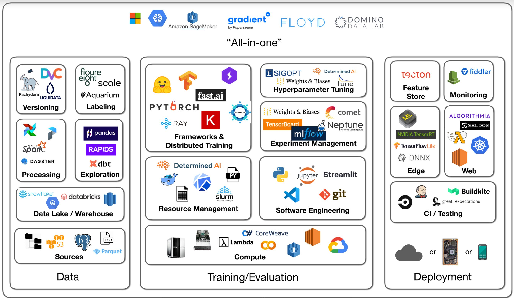

# Overview

<figure markdown>
  { width="500" }
  <figcaption>AI Infrasturcture</figcaption>
</figure>

## Infrastructures

### 1. Scientific computation, Data preparation and wrangling

|   Name     | Description                          |
| :---------:| :----------------------------------- |
| [`NumPy`](https://numpy.org/)  | NumPy is the fundamental package for scientific computing in Python. It is a Python library that provides a multidimensional array object, various derived objects (such as masked arrays and matrices), and an assortment of routines for fast operations on arrays, including mathematical, logical, shape manipulation, sorting, selecting, I/O, discrete Fourier transforms, basic linear algebra, basic statistical operations, random simulation and much more. |
|  [`Scipy`](https://pandas.pydata.org/) | A fast, flexible, and expressive Python package for working with "relational" or "labeled" data. The module is designed to be the building block for doing practical, real-world data analysis in Python. Furthermore, it aims to become the most powerful and flexible open source data analysis and manipulation tool available. |
| [`Numba`](https://numba.pydata.org/) | Numba is an open source, NumPy-aware optimizing compiler for Python sponsored by Anaconda, Inc. It uses the LLVM compiler project to generate machine code from Python syntax. Numba can compile a large subset of numerically-focused Python, including many NumPy functions. Additionally, Numba has support for automatic parallelization of loops, generation of GPU-accelerated code, and creation of ufuncs and C callbacks. |
|  [`Pandas`](https://pandas.pydata.org/) | A fast, flexible, and expressive Python package for working with "relational" or "labeled" data. The module is designed to be the building block for doing practical, real-world data analysis in Python. Furthermore, it aims to become the most powerful and flexible open source data analysis and manipulation tool available. |
| [`PySpark`](https://www.databricks.com/kr/glossary/pyspark) | PySpark is the collaboration of Apache Spark and Python. In simple terms, it is a Python API for Apache Spark that lets you harness the simplicity of Python as well as the power of Apache Spark to tame Big Data using Python. |
| [`Polars`](https://www.pola.rs/) | Polars is a lightning fast DataFrame library/in-memory query engine. Its embarrassingly parallel execution, cache efficient algorithms and expressive API makes it perfect for efficient data wrangling, data pipelines, snappy APIs and so much more. The goal of Polars is to provide a lightning fast DataFrame library that utilizes all available cores on your machine.|
| [`Dask`](https://www.dask.org/) | Dask is a flexible library for parallel computing in Python. Dask is composed of two parts: 1. Dynamic task scheduling optimized for computation. This is similar to Airflow, Luigi, Celery, or Make, but optimized for interactive computational workloads. 2. "Big Data" collections like parallel arrays, dataframes, and lists that extend common interfaces like NumPy, Pandas, or Python iterators to larger-than-memory or distributed environments. These parallel collections run on top of dynamic task schedulers. | 
| [`Vaex`](https://vaex.io/) | Vaex is a high performance Python library for lazy Out-of-Core DataFrames (similar to Pandas), to visualize and explore big tabular datasets. It calculates statistics such as mean, sum, count, standard deviation etc, on an N-dimensional grid for more than a billion (10^9) samples/rows per second. Visualization is done using histograms, density plots and 3d volume rendering, allowing interactive exploration of big data. Vaex uses memory mapping, zero memory copy policy and lazy computations for best performance (no memory wasted). |

### 2. Specicfic domain data preprocessing

### 3. Machine learning and deep learning

### 4. Visualization

### 5. Development 

