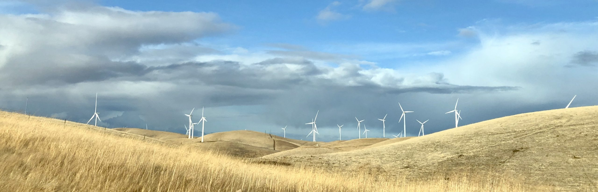
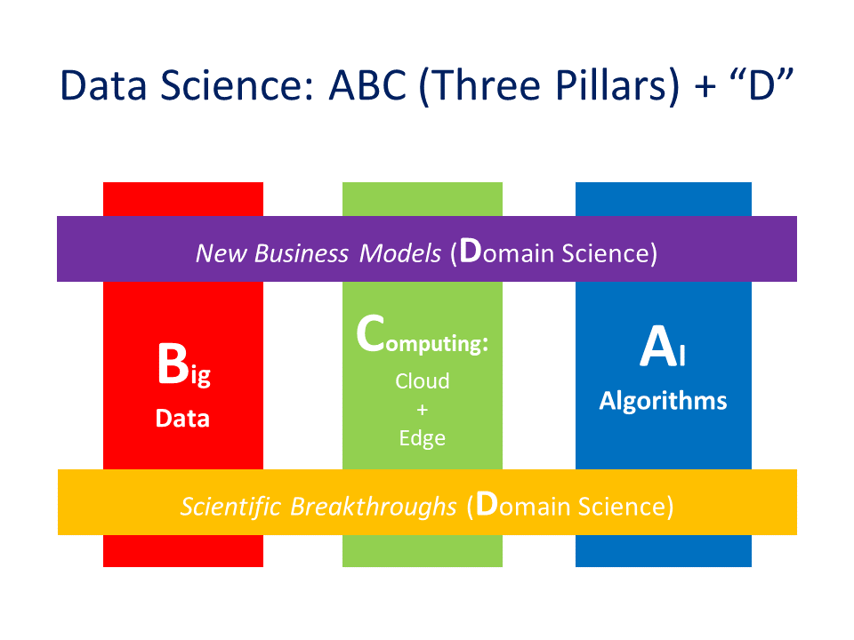

# Welcome

<figure markdown>
  { width="100%" }
</figure>

## Preface

The motivation to prepare a handbook for data science started in 2021. **Prof. Wen-Syan Li**([Link to frofile](https://aml.gsds.snu.ac.kr/members#h.q483l1nrxq5h)) joined the Graduate School of Data Science (GSDS), Seoul National University (SNU) in March 2020, and he taught the Machine Learning & Deep Learning (MLDL) courses in 2020 and 2021 and the Big Data & Knowledge Management System (BKMS) course in 2022. Although there are many textbooks available on the market. However, most books focus on either statistical analysis or theorem  aspects of machine learning & deep learning, they do not satisfy one of the essential aspects of data science - hands-on experience and conduct tasks in the data science life cycle end to end. Much information is available on the internet: blob, seminars, conference tutorials, personal websites, Youtube, and online education service providers, like Coursera. It is time-consuming to allocate all the information, especially the information that is evolving and expanding at a fast speed.  

GSDS at SNU does have a category of the project in its qualifying examination for both master and Ph.D students. However, due to time limitations, the project exam for GSDS features simple problem-solving in the machine learning module training task that lasts for 48 hours. We are not able to evaluate students’ understanding and skills in the full end-to-end data science life cycle, especially data preparation, data augmentation, model performance monitoring, etc, some important tasks a data scientist should be familiar with. 

In the Fall of 2021, Professor Li proposed to have a project course for data science for both master and Ph.D student-level major students in GSDS, SNU to cover end-to-end tasks in the data science life cycle. The new project course “Project for Data Science” will start in the 2022 Fall semester as a required course for all students in GSDS. The project course aims at training GSDS students to practice their end-to-end skills In preparation for this project course, Professor Li and a few students started to collect content and prepare this Handbook for Learning Data Science.

We appreciate the support from the Dean of GSDS, Professor Sang K. Cha for the idea of data science lies in the principle of Algorithms, Big Data, and Computation on the cloud or edge, plus Domain expertise to bring new business models and scientific breakthrough (i.e. domain science).  End-to-end practices are essential to data scientists. As a matter of a fact, GSDS, SNU’s required course work ([\[GSDS\] Curriculum - Graduate School of Data Science (snu.ac.kr)](https://gsds.snu.ac.kr/gsds_curr/)) since 2022 has aligned to support this direction - two required courses in each column of A, B, and C plus a project course to practice students’ end to end hand-on skill with their own domain expertise. The three pillars of the current revolution in data science are illustrated in Figure 1.

<figure markdown>
  { width="480" }
  <figcaption>Figure 1. The three pillars of the current revolution in data science and the domain</figcaption>
</figure>

We also like to acknowledge the inspiration from a course “Full Stack Deep Learning” offered by UC, Berkeley in 2019 and 2021 [https://fullstackdeeplearning.com/](https://fullstackdeeplearning.com/). This course offers not only the theory of deep learning but also substantial materials on all tasks in the end-to-end life cycle (i.e. full stack), including  project management, data management, infrastructure, etc. beyond typical school assignments that cover data loading and model training. The Full-Stack Deep Learning course demonstrates the need for a data scientist to master all tasks end to end (i.e. full stack) in the data science life cycle. 